# GitHub Actions CI/CD Flow Architecture

This document explains the complete flow of how the `go-sample-app` gets built, containerized, and deployed using the modular `platform-github-actions` repository, self-hosted runners, and local Kubernetes cluster.

## Overview

The architecture consists of four main components:
1. **go-sample-app** - The Go application with Helm charts
2. **platform-github-actions** - Reusable workflow templates and actions
3. **Self-hosted GitHub Actions Runner** - Executes the workflows locally
4. **Local Kubernetes Cluster** - Target deployment environment

## High-Level Architecture Flow

```mermaid
graph TB
    subgraph "Developer Workflow"
        DEV[Developer] --> COMMIT[Git Commit/Push]
        DEV --> MANUAL[Manual Workflow Dispatch]
    end
    
    subgraph "GitHub Repository: go-sample-app"
        COMMIT --> TRIGGER[".github/workflows/dev.yml<br/>Workflow Triggered"]
        MANUAL --> TRIGGER
        TRIGGER --> CALL["Calls platform-github-actions<br/>dev-go-build.yml"]
    end
    
    subgraph "GitHub Repository: platform-github-actions"
        CALL --> REUSABLE["Reusable Workflow<br/>dev-go-build.yml"]
        REUSABLE --> ACTIONS["Individual Actions:<br/>• lint<br/>• unit-test<br/>• build<br/>• docker-build-push<br/>• security-scan<br/>• helm-deployment"]
    end
    
    subgraph "Self-Hosted Runner (macOS ARM64)"
        ACTIONS --> RUNNER["GitHub Actions Runner<br/>Executes Jobs"]
        RUNNER --> BUILD["Build ARM64 Binary"]
        RUNNER --> DOCKER["Build Docker Image (Local)"]
        RUNNER --> SECURITY["Security Scan"]
        SECURITY --> PUSH["Push to GHCR (Only if Secure)"]
        PUSH --> DEPLOY["Deploy via Helm"]
    end
    
    subgraph "Local Kubernetes Cluster"
        DEPLOY --> HELM["Helm Chart Deployment"]
        HELM --> PODS["Running Pods<br/>(2 replicas)"]
        PODS --> SERVICE["NodePort Service<br/>Port 80→8080"]
    end
    
    subgraph "Access"
        SERVICE --> PORTFWD["kubectl port-forward<br/>localhost:8080"]
        PORTFWD --> WEBAPP["Calculator Web App<br/>http://localhost:8080"]
    end

    style DEV fill:#e1f5fe
    style RUNNER fill:#f3e5f5
    style PODS fill:#e8f5e8
    style WEBAPP fill:#fff3e0
```



## Detailed Component Breakdown

### 1. Application Repository Structure


### 2. Platform Actions Repository Structure


## Complete CI/CD Pipeline Flow


## Key Technical Details

### Image Tagging Strategy
- **Format**: `feature-summary-YYYYMMDD.{run_number}`
- **Example**: `feature-summary-20250616.89`
- **Registry**: `ghcr.io/osru-leu/go-sample-app/go-sample-app:tag`

### Architecture Compatibility
- **Build Target**: `GOOS=linux GOARCH=arm64`
- **Runner**: macOS ARM64 (Apple Silicon)
- **Container**: ARM64 compatible
- **Kubernetes**: Local cluster on ARM64

## Security-First Pipeline Flow

```mermaid
graph TB
    SETUP[setup] --> LINT[lint]
    LINT --> TEST[test]
    TEST --> BUILD[build]
    BUILD --> PACKAGE[docker-build-push - build only]
    SETUP --> PACKAGE
    PACKAGE --> SECURITY[security scan]
    SECURITY --> PUSH[push-to-registry]
    PUSH --> DEPLOY[deploy-k8s]
    
    subgraph "🛡️ SECURE PROCESS"
        PACKAGE -.->|"Build image locally<br/>NO push yet"| LOCAL[Local Docker Image]
        SECURITY -.->|"Scan local image<br/>BEFORE publishing"| SCAN[Security Scan Results]
        PUSH -.->|"Push ONLY if<br/>security scan passes"| GHCR[GitHub Container Registry]
    end
    
    style PACKAGE fill:#e8f5e8
    style SECURITY fill:#e8f5e8
    style PUSH fill:#e8f5e8
```



### Security Benefits
- **🔒 Build First**: Images are built locally without immediate publication
- **🛡️ Scan Before Push**: Security scans run on local images before registry push
- **✅ Conditional Push**: Only security-approved images reach the container registry
- **🚫 Fail Fast**: Pipeline stops if vulnerabilities are detected, preventing publication

## Workflow Triggers and Conditions

```mermaid
flowchart TD
    START[Workflow Trigger] --> PUSH_CHECK{Push to branch?}
    START --> DISPATCH_CHECK{Manual dispatch?}
    
    PUSH_CHECK -->|Yes| BUILD_ONLY["Build, Scan & Push Image<br/>No Deployment"]
    DISPATCH_CHECK -->|Yes + Deploy K8s checked| FULL_DEPLOY["Build, Scan, Push & Deploy"]
    DISPATCH_CHECK -->|Yes + Deploy K8s unchecked| BUILD_ONLY
    
    BUILD_ONLY --> STEPS1["• Lint<br/>• Test<br/>• Build<br/>• Docker Build (local)<br/>• Security Scan<br/>• Push to Registry"]
    FULL_DEPLOY --> STEPS2["• Lint<br/>• Test<br/>• Build<br/>• Docker Build (local)<br/>• Security Scan<br/>• Push to Registry<br/>• Deploy to K8s"]
    
    STEPS1 --> END1[Secure Image in GHCR]
    STEPS2 --> END2[Running Secure App in K8s]
```



## Error Handling and Resilience

### Helm Conflict Resolution
```bash
# Automatic cleanup of stuck operations
if helm list -n default --pending --failed | grep -q go-sample-app; then
  echo "⚠️ Found stuck Helm operation, cleaning up..."
  helm uninstall go-sample-app -n default || true
  sleep 5
fi
```

### Authentication
- **GHCR**: Uses `${{ github.token }}` for authentication
- **Kubernetes**: Uses `ghcr-secret` for image pulls
- **Self-hosted**: Runner has direct cluster access

## Monitoring and Observability

### Pipeline Visibility
- **GitHub Actions UI**: Real-time job progress
- **Step Summaries**: Deployment details and status
- **Artifacts**: Test coverage, security reports
- **Container Registry**: Image versions and metadata

## Benefits of This Architecture

1. **Modularity**: Reusable actions across multiple projects
2. **Consistency**: Standardized build and deployment patterns
3. **Local Development**: Self-hosted runner with direct cluster access
4. **Security-First**: Images scanned before publication, fail-fast on vulnerabilities
5. **Flexibility**: Manual deployment control with automatic builds
6. **Observability**: Comprehensive logging and status reporting
7. **ARM64 Native**: Optimized for Apple Silicon with Rancher Desktop integration
8. **Composite Actions**: Cross-platform compatibility without containerized action limitations

## Security Enhancements

This pipeline implements **security-first DevSecOps practices**:

- **🔒 Local Build**: Images built locally before any publication
- **🛡️ Pre-Publication Scanning**: Security analysis runs before registry push
- **✅ Conditional Publishing**: Only vulnerability-free images reach the registry
- **🚫 Fail-Fast**: Pipeline stops immediately if security issues are found
- **📊 Security Reporting**: Detailed vulnerability reports in GitHub Security tab
- **🔄 Automated Updates**: Security patches can trigger rebuilds

This architecture provides a robust, scalable, and **secure** foundation for Go application development and deployment while maintaining developer productivity and operational reliability. 


```mermaid
flowchart TD
  A[Developer pushes code] --> B[GitHub Actions triggered]
  B --> C[Run Lint/Test]
  C --> D{Tests Passed?}
  D -- No --> E[Fail the pipeline & notify]
  D -- Yes --> F[Build Docker Image]
  F --> G[Push to GHCR/Registry]
  G --> H[Deploy to Dev Environment]
  H --> I{Manual Approval?}
  I -- No --> J[Stop Deployment]
  I -- Yes --> K[Deploy to Prod Environment]
  ```